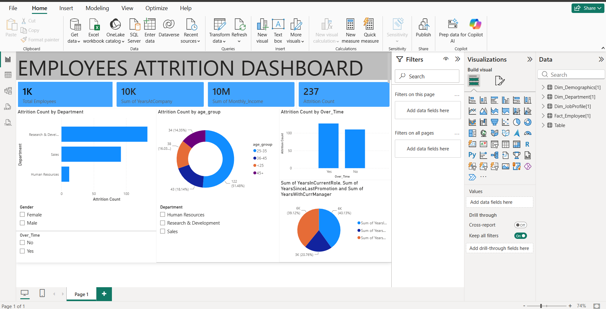

# 📊 Employee Attrition Dashboard

An interactive Power BI dashboard designed to analyze workforce turnover, identify key drivers of employee attrition, and help HR leadership make data-driven retention decisions.

---

## 📈 Dashboard Preview

---

## 🔍 Key Insights & Business Findings

* **Overall Attrition Rate:** Highlights the overall percentage of employees leaving the organization versus total headcount.
* **Departmental Turnover:** Identifies high-risk departments (e.g., Sales, R&D) with elevated departure rates.
* **Tenure & Age Demographics:** Shows that early-career employees (0–2 years of service) have the highest likelihood of leaving.
* **Work-Life & Job Satisfaction:** Correlates low job satisfaction ratings and excessive overtime with increased attrition risk.

---

## 🛠️ Tools & Technologies Used

* **Power BI Desktop:** Data modeling, DAX measures, and visual dashboard design.
* **Power Query:** Data cleaning, transformation, and shape formatting.
* **DAX (Data Analysis Expressions):** Created custom measures for Attrition Rate %, Headcount, and Active Employees.

---

## 🚀 How to View This Project

1. **Download the File:** Click on `Employee_Attrition_Dashboard.pbix` above and select **Download raw**.
2. **Open in Power BI:** Open the downloaded `.pbix` file using **Power BI Desktop** (free to install).
3. **Interact:** Click through filters and charts to explore dynamic insights.

